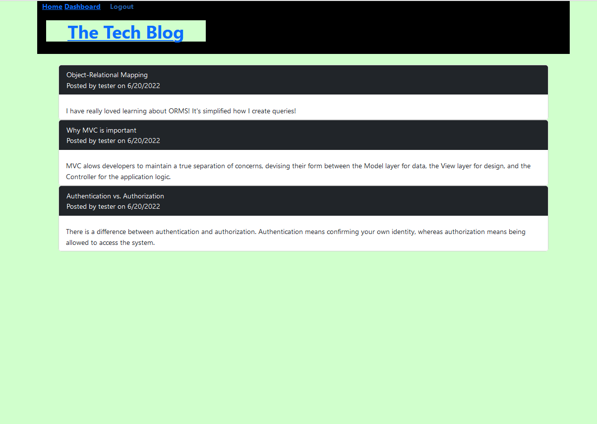

# mvc-tech-social-blog

## Description
This challenge comprises of using the MVC model structure to create a web application.  
MVC is the Model, View, Controller paradigm that separates the different components of the code.  

## Technologies Used
- express-handlebars
- Heroku
- mysql

## Rendered Page

## Issues
- Currently not working in Heroku only on local server.

## Demo

Link: https://drive.google.com/file/d/1UHOY929xiKELplK5vu1xp2qyS84vw2Pk/view